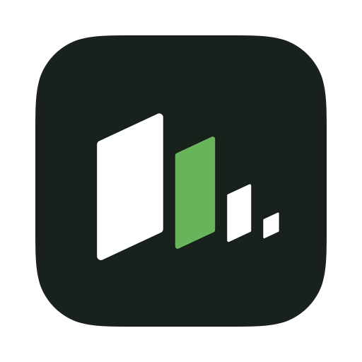
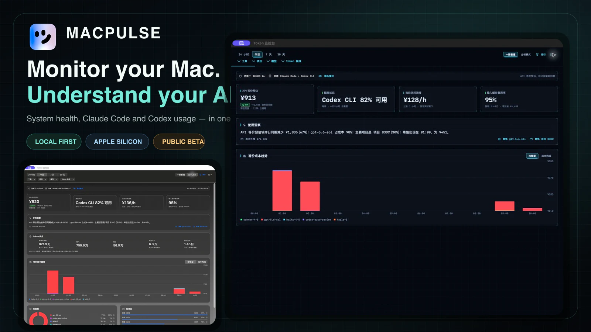
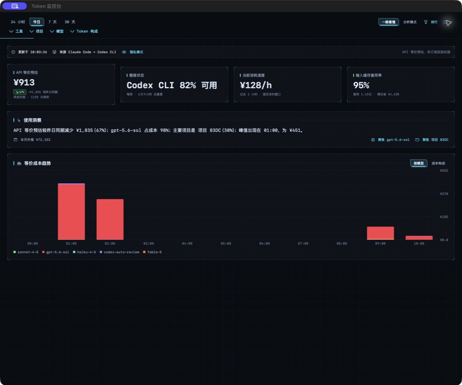
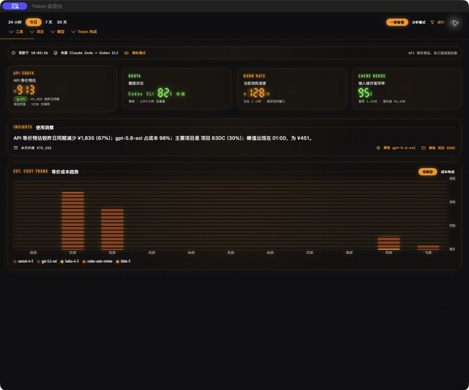
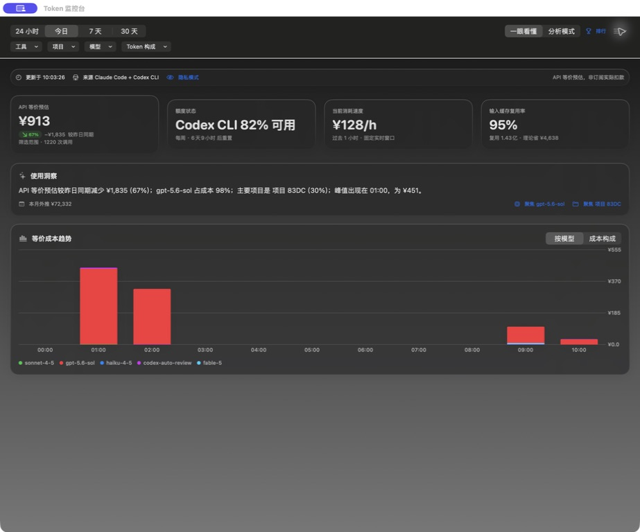
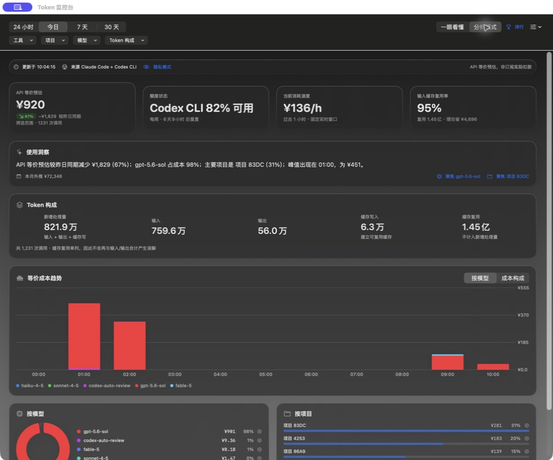
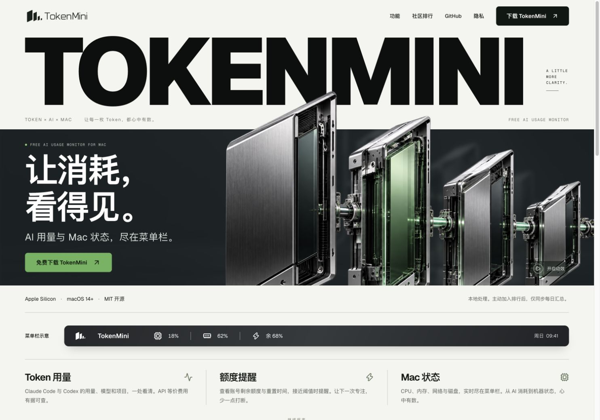

<div align="center">
  
  <h1>MacPulse</h1>
  <p><strong>看懂你的 Mac，也看懂 AI 用量。</strong></p>
  <p>面向 Apple Silicon 的原生菜单栏监控器：系统健康、Claude Code 与 Codex 用量、成本预估、额度和本地优先工具。</p>

  <p><a href="README.md">English</a> · <a href="README.zh-CN.md">简体中文</a></p>

  <p>
    <a href="https://github.com/ai798-Lab/MacPulse/releases/latest"></a>
    <a href="https://github.com/ai798-Lab/MacPulse/actions/workflows/ci.yml"></a>
    <a href="LICENSE"></a>
    
  </p>
  <p>
    
    
    
    
  </p>

  <p>
    <a href="https://github.com/ai798-Lab/MacPulse/releases/latest"><strong>下载最新签名 DMG</strong></a>
    · <a href="https://macpulse-monitor.peaceaii.chatgpt.site">官网</a>
    · <a href="#产品图集">产品图集</a>
    · <a href="PRIVACY.md">隐私说明</a>
  </p>
</div>



> [!IMPORTANT]
> 当前正式公开版本与已签名 Sparkle 更新源仍是 **v0.9.0**。`main` 分支包含尚未发布的 v0.10 预览功能，包括可选社区排行。上方语言切换只切换项目文档；应用界面目前仍以中文为主。

## 为什么是 MacPulse

| | 你能得到什么 |
| --- | --- |
| **系统脉搏** | 在菜单栏查看 CPU、内存、网络、磁盘、电池、温度、风扇和高占用进程。 |
| **AI 用量** | 本地汇总 Claude Code 与 Codex JSONL，会话 Token 构成、趋势和 API 等价成本一目了然。 |
| **额度感知** | Claude/Codex 额度窗口、重置倒计时、可选通知与刘海体验。 |
| **本地优先工具** | 隐私模式、安全缓存清理、有界内存回收、进程结束和可恢复的 Skills 管理。 |

MacPulse 面向高频使用 AI 编程工具、同时又希望看清电脑状态的人。默认“一眼看懂”模式先回答三个实际问题：额度还能撑多久、今天的速度会不会太贵、电脑现在是否吃力；需要时再切换分析模式查看 Token、模型和项目明细。

## 产品图集

### 三套视觉系统

| HUD | LED | 经典 |
| --- | --- | --- |
|  |  |  |

### 分析模式



### 公开官网



以上 App 截图均来自实际构建的 macOS 应用，并已开启隐私模式：真实项目名被替换成稳定别名。服务不可用、凭证、管理后台和私人路径等画面不会用于公开展示。

## 功能

<details open>
<summary><strong>系统监控</strong></summary>

- 菜单栏常驻 CPU、内存和今日 AI API 等价预估；可选显示最紧张额度。
- CPU 总量/用户/系统占比、实时曲线和 AppleSMC 温度采样。
- 内存压力与压缩、磁盘和网络吞吐、电池健康与风扇转速。
- CPU/内存高占用进程排行；发送 `SIGTERM` 前必须确认。
- 缓存清理使用纯词法路径校验、保护目录和沙盒式回归测试守住删除边界。

</details>

<details open>
<summary><strong>AI 用量与额度</strong></summary>

- 读取本机 Claude Code（`~/.claude/projects`）与 Codex（`~/.codex/sessions`）JSONL。
- 今日与本月 API 等价预估、近一小时速度、七日趋势、模型/项目下钻和缓存复用率。
- 两个标识都存在时按 `messageId:requestId` 全局去重，与 ccusage 语义保持一致。
- Claude OAuth 额度默认关闭且完全可选；Codex 额度从本地 rollout 事件推导。
- 所有金额都用于比较与规划，不代表订阅账单或真实扣款。

</details>

<details>
<summary><strong>体验与可选工具</strong></summary>

- 一眼看懂与分析模式两套信息密度。
- 经典、HUD、LED 三套主题，覆盖弹窗、监控台和刘海界面。
- 本机 Skills 发现、安装、复制，以及移动到废纸篓的可恢复卸载。
- 可选额度重置和久坐关怀提醒；均有节流并受总开关控制。
- `main` 上含尚未发布的 v0.10 社区排行预览；不登录不影响本地监控。

</details>

## 下载与要求

| 要求 | 支持情况 |
| --- | --- |
| 硬件 | Apple Silicon（`arm64`） |
| macOS | 14 或更高版本 |
| 分发 | GitHub Releases、Developer ID 签名与 Apple 公证 |
| App Store | 不提供；沙盒会阻止 SMC 和本机会话读取 |

1. 从 [GitHub Releases](https://github.com/ai798-Lab/MacPulse/releases/latest) 下载最新 `.dmg`。
2. 将 `MacPulse.app` 拖入 `/Applications`。
3. 打开应用，先阅读首次启动隐私说明，再决定是否开启可选功能。

> [!NOTE]
> Homebrew 已有另一个 macOS 产品使用 `macpulse` cask 名称。本项目目前不提供 Homebrew 安装命令，请使用本仓库的已签名 GitHub Release。

## 隐私模型

MacPulse 以本地处理为默认，不上传会话正文、提示词、回复、真实项目路径或 AI 凭证，也不启用产品分析、广告遥测或自动崩溃上报。

只有用户可感知功能会联网，例如检查更新、可选 Claude 额度、从用户指定 GitHub 仓库安装 Skill，以及可选社区排行。详细边界见 [隐私说明](PRIVACY.md) 与 [安全策略](SECURITY.md)。

## 从源码构建

需要得到可运行 App 包时请使用项目脚本，不要把裸 `swift build` 当成分发结果：

```bash
./scripts/test.sh
./scripts/build.sh 0.10.0 3
open dist/MacPulse.app
```

项目采用 Swift 5 语言模式、目标 macOS 14+，使用 Swift Package Manager。构建脚本会编译、组装 `dist/MacPulse.app`、按需生成图标，并为本地测试执行 ad-hoc 签名。

公开发布产物必须经过 Developer ID 签名、Apple 公证，并通过已签名的 Sparkle appcast 分发。维护者凭证与内部发布手册刻意保留在公开仓库之外；`SKIP_NOTARIZE=1` 生成的产物不得公开分发。

## 架构要点

- SwiftUI `MenuBarExtra(.window)` 与 Swift Charts；不依赖 Xcode 工程文件。
- CPU/内存使用 Mach API，网络使用 `getifaddrs`，磁盘/电池使用 IOKit，温度/风扇使用 AppleSMC。
- `@MainActor` 可观察状态背后使用各自串行采样队列。
- Sparkle 2 提供签名应用更新。
- 独立官网与轻量 worker 承载可选社区排行预览。

## 贡献与反馈

- 提交 Pull Request 前请阅读 [CONTRIBUTING.md](CONTRIBUTING.md)。
- 使用结构化[错误报告](https://github.com/ai798-Lab/MacPulse/issues/new?template=bug_report.yml)，并移除 token、会话正文、用户名和真实项目路径。
- 安全问题请使用 GitHub 私密漏洞报告，不要在公开 Issue 中粘贴凭证。
- 版本历史见 [CHANGELOG.md](CHANGELOG.md)。

## 致谢

MacPulse 的灵感来自 SystemPal，并参考了 [exelban/stats](https://github.com/exelban/stats) 与 [ccusage](https://github.com/ryoppippi/ccusage)。第三方许可见 [THIRD_PARTY_NOTICES.txt](THIRD_PARTY_NOTICES.txt)。

## 许可证

[MIT](LICENSE) © 2026 Liang Heping
